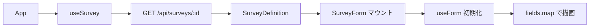
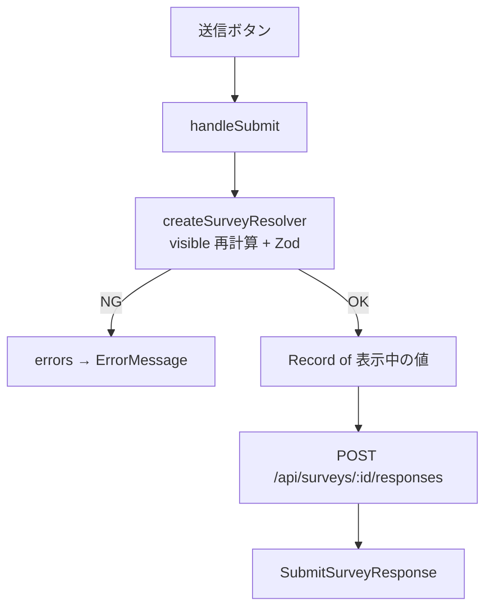

# ディレクトリ構成（DMMF）

責務ごとにレイヤーを分けた構成。**Domain → Infrastructure → Features → Shared → App** の依存方向。

- 設計方針・拡張手順: [design-guide.md](./design-guide.md)
- **フォーム設計（送受信・RHF・Zod）**: [form-design.md](./form-design.md)

```
src/
├── app/                    # 起動・画面シェル
├── domain/                 # ビジネスロジック（React / fetch 非依存）
├── infrastructure/         # API・MSW など外部 I/O
├── features/               # 機能単位の UI + hooks
└── shared/                 # 機能横断の UI 部品
```

---

## フォームサブシステム概要

アンケート回答 UI は **定義 JSON を受信 → 動的にフォーム生成 → 検証して送信** の3フェーズ。

| フェーズ | 概要 | 詳細 |
|----------|------|------|
| **受信** | GET で `SurveyDefinition` を取得し `SurveyForm` をマウント | [form-design.md §2](./form-design.md#2-受信フロー定義の取得--フォーム生成) |
| **入力** | RHF + `watch` + `getVisibleFieldIds` で表示を更新 | [form-design.md §3](./form-design.md#3-入力フロー操作中のフォーム内部) |
| **送信** | Zod 検証後 POST | [form-design.md §4](./form-design.md#4-送信フロー検証--post) |

---

## フォーム受信フロー（定義 GET → 画面）



| ステップ | コンポーネント / API | 出力 |
|----------|----------------------|------|
| 1 | `useSurvey(surveyId)` | `loading` → `success` |
| 2 | `fetchSurveyDefinition` | JSON → `SurveyDefinition` |
| 3 | `App` が `SurveyForm` に `definition` を渡す | — |
| 4 | `useForm` + `createSurveyResolver` | 空のフォーム状態 |
| 5 | `getVisibleFieldIds` + `fields.map` | ルート設問から表示 |

開発時: MSW が `infrastructure/mocks/fixtures/survey.sample.json` 相当を返す。

---

## フォーム送信フロー（検証 → POST）



| ステップ | 処理 | 備考 |
|----------|------|------|
| 1 | `handleSubmit` | RHF が values を集約 |
| 2 | `getVisibleFieldIds(values)` | 送信時点の visible を再計算 |
| 3 | `buildSurveyZodSchema` | 表示中キーのみ Zod object |
| 4 | 成功時 `onSubmit(data)` | `shouldUnregister` 済みのペイロード |
| 5 | `submitSurveyResponse` | 201 + `responseId` |

非表示だった設問はペイロードに**含まれない**（ゴーストデータ防止）。

---

## フォーム関連コンポーネントマップ

```
app/App.tsx
  └── useSurvey          … 定義の受信
  └── SurveyForm         … フォームのルート

features/survey/components/
  ├── SurveyForm           … FormProvider / map / submit
  ├── SurveyFieldRenderer  … type 別に Shared field を選択
  ├── RepeatFieldSection   … useFieldArray + 件数同期
  ├── RepeatBlockList
  └── RepeatBlockSet

shared/ui/form/fields/
  ├── RadioGroupField / CheckboxGroupField / …
  └── ErrorMessage         … formState.errors 表示

domain/survey/services/
  ├── visibility.ts        … 表示セット
  ├── repeat.ts            … 件数パース
  └── validation/          … Zod 動的生成
```

---

## 各レイヤーの責務

| レイヤー | 責務 | 例 |
|----------|------|-----|
| **Domain** | 型・分岐判定・バリデーション・繰り返しルール | `getVisibleFieldIds`, `buildSurveyZodSchema` |
| **Infrastructure** | HTTP クライアント、API リポジトリ、MSW | `fetchSurveyDefinition`, `handlers` |
| **Features** | 画面・ユーザー操作・react-hook-form | `SurveyForm`, `useSurvey` |
| **Shared** | 汎用 UI（設問 ID を知らない） | `InputField`, `RadioGroupField` |
| **App** | エントリポイント、ルートレイアウト | `main.tsx`, `App.tsx` |

## 依存ルール

```
app → features → domain
              → infrastructure → domain
              → shared
features → domain, infrastructure, shared
infrastructure → domain
domain → （他レイヤーに依存しない）
```

## パスエイリアス

| エイリアス | パス |
|------------|------|
| `@app/*` | `src/app/*` |
| `@domain/*` | `src/domain/*` |
| `@infrastructure/*` | `src/infrastructure/*` |
| `@features/*` | `src/features/*` |
| `@shared/*` | `src/shared/*` |

## Domain（survey）

```
domain/survey/
├── model/definition.ts      # SurveyDefinition, SurveyField 型
├── services/
│   ├── visibility.ts        # ドリルダウン表示判定
│   ├── repeat.ts            # 繰り返し件数ユーティリティ
│   └── validation/          # Zod スキーマ動的生成
└── index.ts                 # 公開 API
```

## Infrastructure

```
infrastructure/
├── api/
│   ├── client.ts            # 共通 fetch
│   ├── surveyRepository.ts  # GET / POST
│   └── types.ts             # API レスポンス型
└── mocks/
    ├── handlers.ts
    └── fixtures/            # JSON 定義サンプル
```

## Features（survey）

```
features/survey/
├── hooks/useSurvey.ts       # 定義取得の状態管理
├── components/              # SurveyForm ほか
└── index.ts
```

## 定義 JSON の置き場所

`infrastructure/mocks/fixtures/survey.sample.json`  
本番では同スキーマを API が返す。

## TSDoc

公開 API（Domain / Infrastructure / Features / Shared の export）に TSDoc を付与している。

- モジュール入口: `@packageDocumentation`（`domain/survey/index.ts` など）
- 関数: `@param` `@returns` `@remarks` `@example`
- 内部ヘルパー: `@internal`
- IDE での補完・ホバー確認を想定
