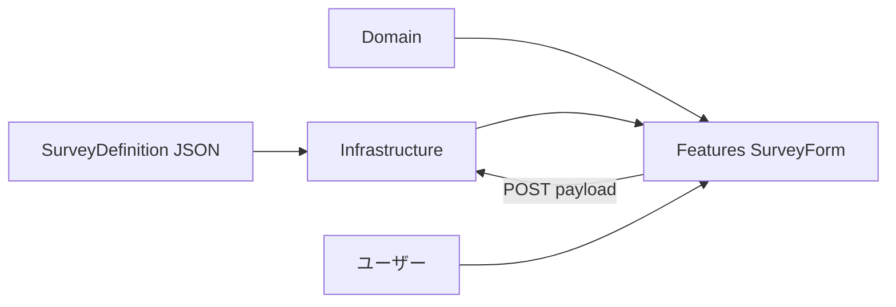

# アンケートフォーム デザインガイド

本ドキュメントは、`survey-drilldown-test` の**設計方針・判断基準・拡張手順**をまとめたガイドです。  
実装の地図は [architecture.md](./architecture.md)、**フォームの送受信・RHF** は [form-design.md](./form-design.md)、JSON の詳細は [survey-definition-schema.md](./survey-definition-schema.md) を参照してください。

---

## 1. このシステムが解く問題

| 要件 | 本プロジェクトでの扱い |
|------|----------------------|
| 設問の条件分岐（ドリルダウン） | JSON `options.drilldown` + Domain の `getVisibleFieldIds` |
| 深掘り（選択に応じた子設問） | トリガー設問 ID ごとに `match` → `show` |
| 繰り返し（件数 N → 同型セット N 個） | `type: repeat` + `options.repeat` + `useFieldArray` |
| 定義の変更にコードを追従させない | **ソースに設問 ID を直書きしない** |
| API 連携 | Infrastructure の repository + MSW |

---

## 2. 設計原則（5つ）

### 2.1 定義駆動（Definition-driven）

**フォームの形は JSON（API レスポンス）が唯一の正**とする。

- ラベル・選択肢・分岐・必須・繰り返し上限 → 定義 JSON
- React コンポーネントは「型ごとの描画エンジン」に徹する
- 問2を増やす・分岐を変える → **原則 JSON のみ**（Domain の match 演算子を増やす場合は別）

### 2.2 データはフラット、UI だけ階層

| 層 | ネスト |
|----|--------|
| 送信ペイロード | `q1_main`, `q2_options` などフラット + `q2_repeat_items[]` のみ配列 |
| 定義 `fields` | フラット配列（描画順） |
| 画面 | インデント等の見た目で「親子」を表現してよい |

**避ける:** `survey.sections[0].questions[1].children` のような深い JSON ツリー。

### 2.3 分岐は「トリガー設問」単位で書く

`visibilityGroups` のような抽象名ではなく、**`options.drilldown["q1_main"]`** のように「q1 ではこう」と読める形にする。

- 変更時: 触るトリガー設問のブロックだけを grep
- 共通条件: `{ "match": { "in": ["A", "D"] }, "show": [...] }` で再利用

### 2.4 バリデーションは Zod に一本化

- Field コンポーネントの `register({ required: ... })` は使わない
- 送信時に **その時点の visible** から Zod スキーマを動的生成（`createSurveyResolver`）
- 非表示フィールドは `shouldUnregister: true` で値も検証も対象外

### 2.5 レイヤー分離（DMMF）

| 層 | 知ってよいこと | 知ってはいけないこと |
|----|----------------|----------------------|
| **Domain** | 型・分岐・Zod・繰り返し件数 | React, fetch, 設問 ID のハードコード |
| **Infrastructure** | HTTP, MSW, fixture | JSX, `watch` |
| **Features** | 画面・hooks・RHF | `q1 === "A"` の直書き |
| **Shared** | `name` を受け取る UI | `q2_options` など固有 ID |

依存方向: `App → Features → Domain / Infrastructure → Domain`、`Features → Shared`。

---

## 3. コア概念の関係



| 概念 | 役割 | 主な実装 |
|------|------|----------|
| **SurveyDefinition** | 設問マスタ | `domain/survey/model/definition.ts` |
| **drilldown** | いつ何を出すか | `getVisibleFieldIds` |
| **rules** | 常時表示 / 初期非表示、必須区分 | `isFieldRequired` + Zod |
| **repeat** | 件数と上限 | `parseRepeatCount` + `useFieldArray` |
| **SurveyForm** | 定義を map して描画 | `features/survey/components/SurveyForm.tsx` |

---

## 4. 定義 JSON の設計ルール

### 4.1 トップレベル

```json
{
  "id": "survey-001",
  "title": "画面タイトル",
  "fields": [ /* 設問の中身・フラット */ ],
  "options": { /* 振る舞い */ }
}
```

`presentation` や `settings.maxRepeatCount` は**トップに置かない**。繰り返し上限は `options.repeat.<fieldId>.maxCount`。

### 4.2 `fields` に書くもの / `options` に書くもの

| 書く場所 | 内容 |
|----------|------|
| `fields[]` | `type`, `label`, `choices`, `placeholder`, `template` |
| `options.drilldown` | トリガーごとの `match` → `show` |
| `options.rules` | `visibility`, `required` |
| `options.repeat` | `countFrom`, `maxCount` |

### 4.3 `id` と `name`

| キー | 用途 |
|------|------|
| `id` | 分岐の `show`、rules、repeat のキー |
| `name` | react-hook-form・送信 JSON のキー（repeat は配列名） |

原則 **一致させてよい**（不一致はデバッグコストが上がる）。

### 4.4 分岐ルール（drilldown）の書き方

```json
"drilldown": {
  "q1_main": [
    { "match": { "in": ["A", "D"] }, "show": ["q2_options"] },
    { "match": "A", "show": ["q3_category"] }
  ]
}
```

| `match` 形式 | 用途 |
|--------------|------|
| `"A"` | radio / select の完全一致 |
| `{ "in": ["A", "D"] }` | 複数選択肢のいずれか |
| `{ "includes": "other" }` | checkbox で値を含む |
| `{ "gte": 1 }` | 数値が以上（件数トリガー） |

成立したルールの `show` は**和集合**（複数ルールが同時に成立しうる）。

### 4.5 必須・非表示（rules）

- **動的な非表示** → `drilldown`（出ていなければ DOM も値もない）
- **必須/任意** → `rules.required`（表示中のみ Zod が適用）
- **初期状態** → ルートは `visibility: "always"`、それ以外は `hidden`

選択肢ごとに「必須が変わる」定義は**原則採用しない**（必要なら将来 `optionalFields` 等で拡張）。

---

## 5. ランタイムの挙動（実装との対応）

### 5.1 表示の決まり方

1. `rules.visibility === "always"` の field を表示候補に入れる
2. `options.drilldown` を全トリガーについて評価し、成立した `show` を足す
3. `SurveyForm` は `visibleIds.has(field.id)` のものだけ描画

### 5.2 繰り返し

1. `q2_repeat_count` が表示され、値が 1 以上
2. `options.repeat.q2_repeat_block` の `maxCount` でクリップ
3. `useFieldArray.replace` で配列長を件数に同期
4. `template` に従い各セットを描画

### 5.3 送信・検証

1. ユーザーが送信
2. `createSurveyResolver` が**送信時点の values** で visible を再計算
3. 表示中フィールドだけを含む Zod `object` で検証
4. OK なら `submitSurveyResponse` で POST

---

## 6. 変更シナリオ別チェックリスト

### 6.1 設問を1つ追加する

- [ ] `fields` に新要素（`id`, `name`, `type`, `label` …）
- [ ] `options.rules` に `visibility: "hidden"`（ルート以外）
- [ ] 出す条件を `options.drilldown` の適切なトリガーに `show` で追加
- [ ] TypeScript: `SurveyField` ユニオンに新 type が要るか確認
- [ ] `SurveyFieldRenderer` の switch に case が要るか確認

### 6.2 分岐だけ変える（例: D から問2を外す）

- [ ] **`options.drilldown` のみ**（`fields` は触らない）
- [ ] フロントの `showQ2` 直書きが残っていないか grep

### 6.3 ラベル・選択肢の文言だけ変える

- [ ] **`fields` のみ**（コード変更なし）

### 6.4 繰り返し上限を変える

- [ ] `options.repeat.<blockId>.maxCount`
- [ ] 必要なら `fields` 側の number `min` も整合

### 6.5 新しい match 演算子が必要

- [ ] `DrilldownMatch` 型を拡張（`domain/.../definition.ts`）
- [ ] `matches()` を拡張（`services/visibility.ts`）
- [ ] JSON サンプル・MSW fixture を更新

---

## 7. アンチパターン（やらないこと）

| アンチパターン | 理由 | 代わりに |
|----------------|------|----------|
| `SurveyForm` に `showQ2 = q1 === "A"` | 定義変更でデプロイが必要 | `getVisibleFieldIds` |
| ネストした回答 JSON | API・分析が複雑 | フラット + 配列のみ |
| `register` と Zod の二重バリデーション | メッセージ・条件がズレる | Zod のみ |
| 非表示フィールドを `display:none` だけ | 値が残り送信される | 条件付きレンダリング + `shouldUnregister` |
| 全設問を1つの Zod スキーマに固定 | 分岐に追従しない | 送信時動的生成 |
| Feature から Domain を bypass して fetch | 責務が散る | `@infrastructure/api` |

---

## 8. API 契約（Infrastructure）

| メソッド | パス | レスポンス / Body |
|----------|------|-------------------|
| GET | `/api/surveys/:surveyId` | `SurveyDefinition` |
| POST | `/api/surveys/:surveyId/responses` | Body: フォーム値 / Res: `SubmitSurveyResponse` |

開発時は MSW が同じパスをインターセプト。fixture: `infrastructure/mocks/fixtures/survey.sample.json`。

---

## 9. 関連ドキュメント

| ドキュメント | 内容 |
|--------------|------|
| [architecture.md](./architecture.md) | ディレクトリ構成・依存・TSDoc |
| [survey-definition-schema.md](./survey-definition-schema.md) | JSON キーリファレンス |
| [form-design.md](./form-design.md) | フォーム受信・入力・送信の設計 |
| [article-sequence-and-flow.md](./article-sequence-and-flow.md) | シーケンス・フローチャート |

コード内ドキュメント: 各層の `index.ts` および公開関数の TSDoc（IDE ホバー）。

---

## 10. Rv 3回の改善サマリ（本ガイドの作成過程）

| 回 | 問題 | 改善 |
|----|------|------|
| **1** | architecture と JSON 仕様が分散 | 「原則 + 手順 + 禁止」を1本のガイドに統合 |
| **2** | 読者が実装者か PM か不明 | 冒頭に「解く問題」、変更はチェックリスト化 |
| **3** | 判断の背景が薄い | 5原則・アンチパターン・「いつ JSON だけで済むか」を明示 |

---

## 11. 用語集

| 用語 | 意味 |
|------|------|
| ドリルダウン | 親設問の回答に応じて子設問を表示すること |
| トリガー設問 | `drilldown` のキーになっている field（例: `q1_main`） |
| visible | 現在のフォーム値で表示対象になった field id の集合 |
| 定義駆動 | 画面構造を JSON から組み立てること |
| DMMF | Domain / Mock+API(Infrastructure) / Features / Shared / App の層分け |
