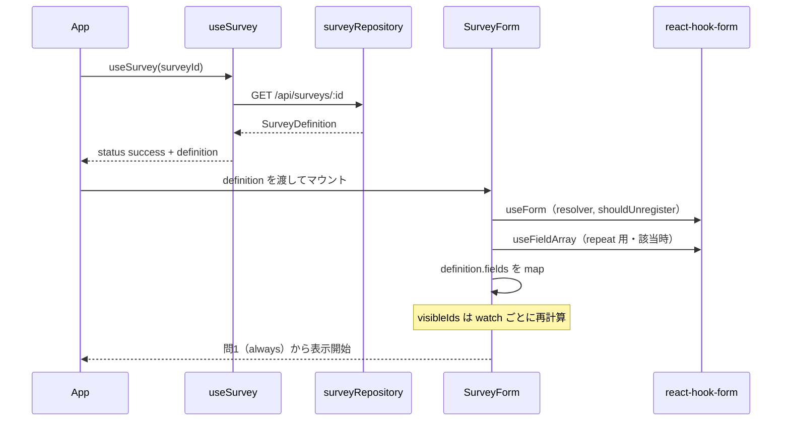
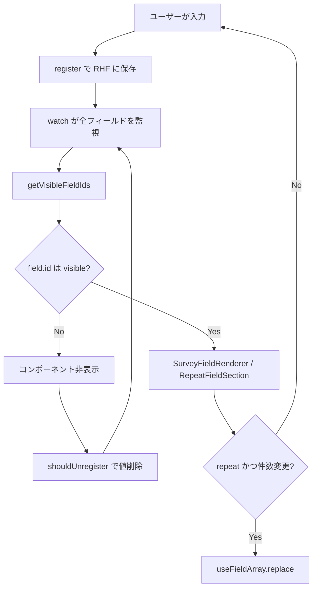
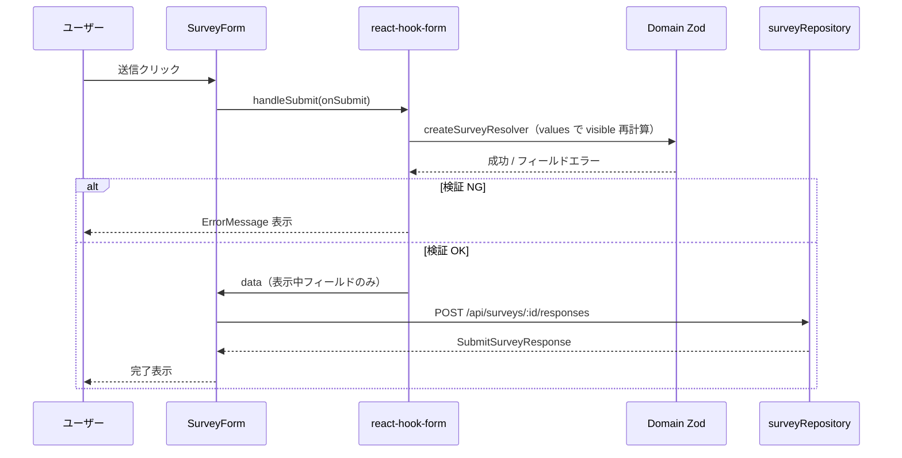

# フォーム設計ガイド

アンケート**回答フォーム**に特化した設計ドキュメント。  
レイヤー全体は [architecture.md](./architecture.md)、原則・禁止事項は [design-guide.md](./design-guide.md) を参照。

---

## 1. フォームの責務

| 責務 | 担当 | やらないこと |
|------|------|--------------|
| 定義の取得 | `useSurvey` + `fetchSurveyDefinition` | 分岐ロジックの直書き |
| 設問の描画 | `SurveyForm` + `SurveyFieldRenderer` | 設問 ID ごとの JSX 分岐 |
| 入力値の保持 | react-hook-form（`FormProvider`） | 自前 useState で全フィールド管理 |
| 表示制御 | `getVisibleFieldIds` + 条件付き render | CSS だけで非表示 |
| 繰り返し同期 | `RepeatFieldSection` + `useFieldArray` | 件数と配列長のズレ放置 |
| 検証 | Zod（`createSurveyResolver`） | `register` 内の required |
| 送信 | `submitSurveyResponse` | alert 以外の本番 UX（将来差し替え可） |

---

## 2. 受信フロー（定義の取得 → フォーム生成）

サーバーから**設問マスタ（SurveyDefinition）**を受け取り、入力可能なフォームを組み立てるまで。



### 2.1 受信データの形（SurveyDefinition）

```json
{
  "id": "survey-001",
  "title": "画面タイトル",
  "fields": [ /* 設問一覧・フラット */ ],
  "options": {
    "drilldown": { /* トリガー → show */ },
    "rules": { /* visibility, required */ },
    "repeat": { /* countFrom, maxCount */ }
  }
}
```

**フォーム側が使うのはこのオブジェクトのみ。** 個別設問の文言・選択肢はすべて `fields` から読む。

### 2.2 マウント時の初期状態

| 項目 | 設定 |
|------|------|
| フォーム値 | 空（未入力） |
| 表示 | `rules.visibility === "always"` の field のみ |
| バリデーション | 未実行（`mode: "onSubmit"`） |
| repeat 配列 | 長さ 0（件数入力前） |

`loading` 中は `SurveyForm` をマウントしない（定義なしで render しない）。

---

## 3. 入力フロー（操作中のフォーム内部）

ユーザーが値を変えるたびに、**表示セット**が更新される。



### 3.1 react-hook-form の設定

```ts
useForm<Record<string, unknown>>({
  shouldUnregister: true,  // 非表示 → DOM 外 → 値・エラーも消える
  resolver: createSurveyResolver(definition),
  mode: "onSubmit",        // 最初の検証は送信時
  reValidateMode: "onChange", // 2回目以降は入力で再検証
});
```

| オプション | 理由 |
|------------|------|
| `shouldUnregister: true` | 分岐で消えた設問を送信・検証対象に含めない |
| 動的 resolver | 送信時点の visible に合わせた Zod |
| `Record<string, unknown>` | 設問 ID が JSON で増減するため固定型を避ける |

### 3.2 コンポーネント構成

```
SurveyForm
├── FormProvider（methods を子に配布）
├── definition.fields.map
│   ├── visible でなければ null
│   ├── type === "repeat" → RepeatFieldSection
│   └── それ以外 → SurveyFieldRenderer
│       └── Shared: Radio / Checkbox / Input / Number / Select
└── submit ボタン
```

**Shared 層**は `name` だけ受け取る。`q1_main` など固有 ID は知らない。

### 3.3 繰り返し（repeat）のフォーム設計

| 概念 | 実装 |
|------|------|
| 件数フィールド | 通常の `number` field（`q2_repeat_count`） |
| 配列フィールド名 | `fields[].name`（例: `q2_repeat_items`） |
| 上限 | `options.repeat.<blockId>.maxCount` |
| 同期 | `parseRepeatCount` → `useEffect` → `replace` |
| 1セットの子 | `template` → `RepeatBlockSet` が map |

件数が `3` のとき、RHF 上は次の形になる。

```json
"q2_repeat_items": [
  { "field_a": "...", "field_b": "...", "field_c": "opt1" },
  { "field_a": "...", "field_b": "...", "field_c": "opt2" },
  { "field_a": "...", "field_b": "...", "field_c": "opt1" }
]
```

---

## 4. 送信フロー（検証 → POST）



### 4.1 検証のタイミング

1. `handleSubmit` が現在の `values` を集める
2. `createSurveyResolver` 内で `getVisibleFieldIds(definition, values)` を**再実行**
3. 表示中 field だけをキーにした `z.object(shape)` で `safeParse`
4. エラーは `formState.errors` → `ErrorMessage`（`name` 一致で表示）

**操作中の `visibleIds`（render 用）と送信時の visible は同じロジック**で計算する（ズレを防ぐ）。

### 4.2 送信ペイロード（リクエスト Body）

表示されていた設問のみが含まれる（`shouldUnregister` 済み）。

**例: 問1=A → 問2=other → 件数2 → 問3=cat1**

```json
{
  "q1_main": "A",
  "q2_options": ["other"],
  "q2_sub_reason": "独自の要件",
  "q2_repeat_count": 2,
  "q2_repeat_items": [
    { "field_a": "a1", "field_b": "b1", "field_c": "opt1" },
    { "field_a": "a2", "field_b": "b2", "field_c": "opt2" }
  ],
  "q3_category": "cat1"
}
```

問1=C のときは `q2_*`, `q3_*` は DOM にもデータにも存在しない。

### 4.3 送信レスポンス（受信）

```json
{
  "responseId": "res-abc12345",
  "surveyId": "survey-001",
  "receivedAt": "2026-05-29T12:00:00.000Z",
  "payload": { /* 送信した Body のエコー */ }
}
```

型: `SubmitSurveyResponse`（`@infrastructure/api`）。

---

## 5. フォーム状態の一覧

| 状態 | 管理場所 | ユーザーへの見え方 |
|------|----------|-------------------|
| 定義取得中 | `useSurvey` status loading | 「読み込み中...」 |
| 定義取得失敗 | `useSurvey` status error | エラー + 再試行 |
| 入力中 | RHF `watch` | 分岐・繰り返しが動的に変化 |
| フィールドエラー | RHF `errors` | 赤文字（ErrorMessage） |
| 送信中 | `isSubmitting` | ボタン disabled・「送信中...」 |
| 送信 API エラー | `submitError` | フォーム下のエラー文 |
| 送信成功 | alert（暫定） | responseId 表示 |

---

## 6. 型・フィールド名の対応

| 定義上 | フォーム上 | 送信 JSON キー |
|--------|------------|----------------|
| `field.id` | 表示判定・rules・repeat のキー | 使わない（id はメタ） |
| `field.name` | `register(name)` | `name` がキー |
| repeat の `name` | `useFieldArray({ name })` | 配列キー |

`id` と `name` は**原則同一**に設計する（デバッグ容易性）。

---

## 7. 実装ファイル早見表（フォーム関連のみ）

| 処理 | ファイル |
|------|----------|
| 定義取得 Hook | `features/survey/hooks/useSurvey.ts` |
| フォーム本体 | `features/survey/components/SurveyForm.tsx` |
| 設問描画 | `features/survey/components/SurveyFieldRenderer.tsx` |
| 繰り返し | `features/survey/components/RepeatFieldSection.tsx` |
| 表示判定 | `domain/survey/services/visibility.ts` |
| Zod | `domain/survey/services/validation/*` |
| 汎用入力 UI | `shared/ui/form/fields/*` |
| GET / POST | `infrastructure/api/surveyRepository.ts` |

---

## 8. フォーム拡張時のチェックリスト

- [ ] 新 `type` は `SurveyField` ユニオン + `SurveyFieldRenderer` の case が必要か
- [ ] `register(name)` の `name` は definition の `field.name` と一致しているか
- [ ] 分岐は `options.drilldown` に閉じ、`SurveyForm` に条件直書きしていないか
- [ ] 必須は `options.rules` + Zod に閉じ、`register({ required })` を使っていないか
- [ ] 非表示時に値が残らないか（`shouldUnregister` + 条件付き render）
- [ ] 送信ペイロードにゴーストキーがないか（DevTools Network で確認）

---

## 9. 関連ドキュメント

| ドキュメント | 内容 |
|--------------|------|
| [architecture.md](./architecture.md) | レイヤー構成・フォーム送受信フロー概要 |
| [design-guide.md](./design-guide.md) | 全体の設計原則・JSON ルール |
| [survey-definition-schema.md](./survey-definition-schema.md) | 定義 JSON リファレンス |
| [article-sequence-and-flow.md](./article-sequence-and-flow.md) | 記事用の図 |
